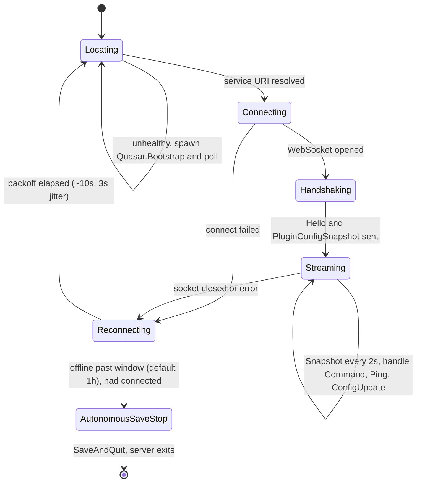
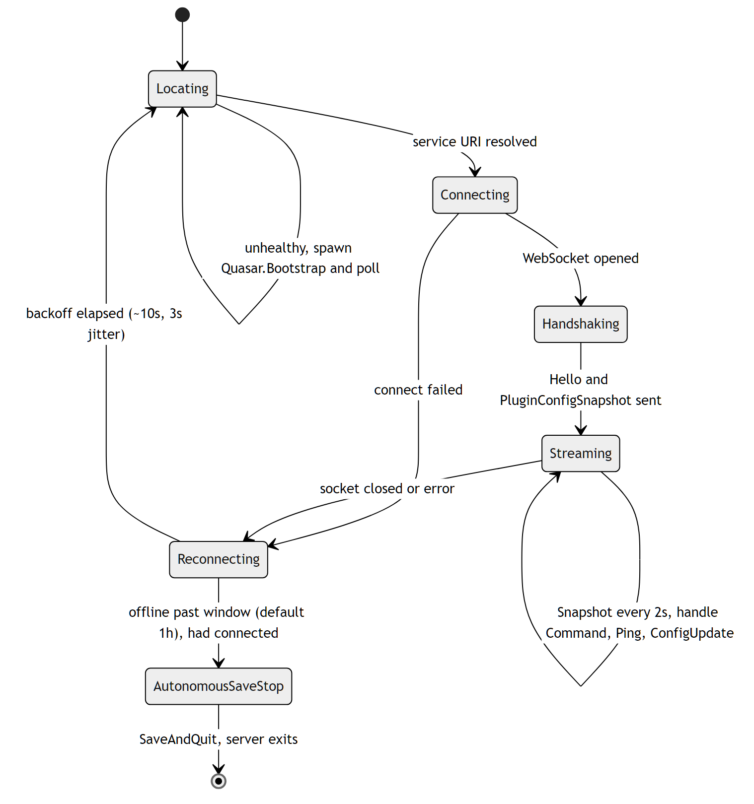
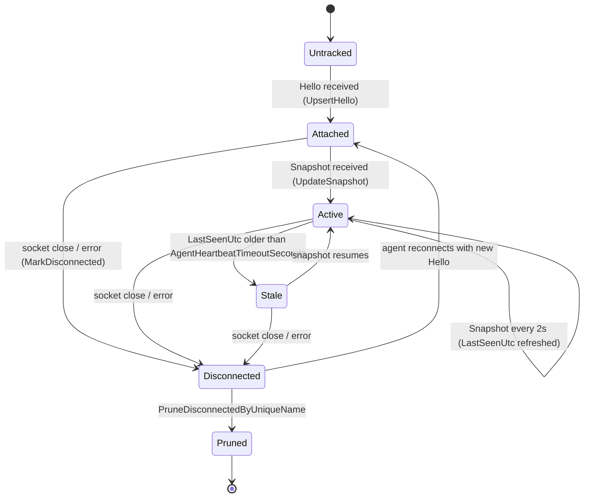
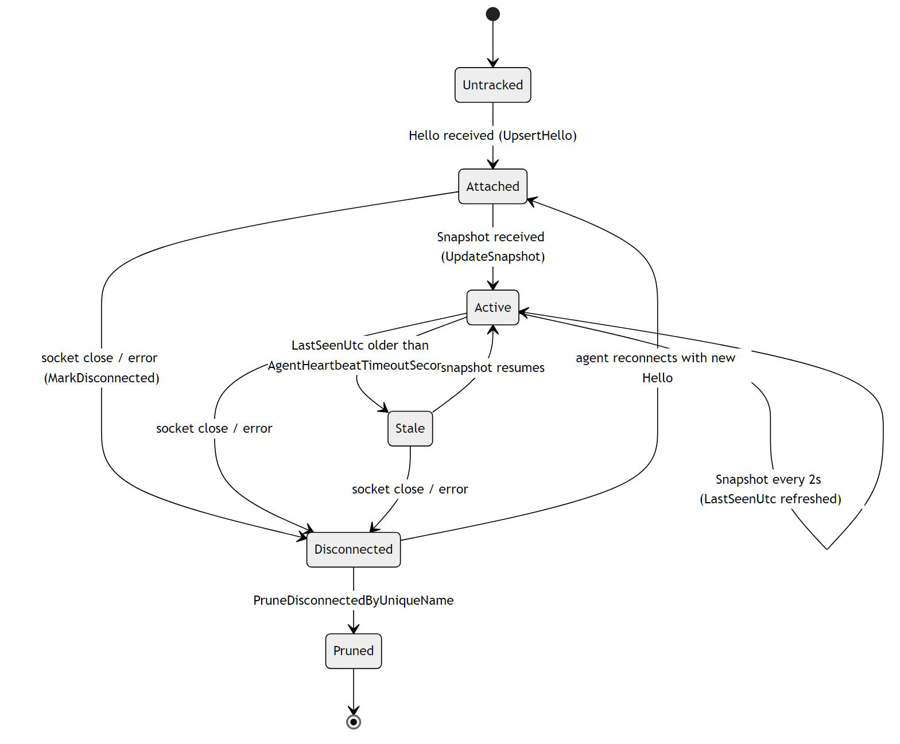

# Agent Connection Lifecycle

`Quasar.Agent` runs inside each Space Engineers dedicated server and attaches to
the Quasar supervisor over a raw WebSocket (`/ws/agent`). There are two
perspectives on one connection: the **agent-side** loop that discovers, connects,
streams, and reconnects, and the **supervisor-side** registry that tracks each
agent as attached/active/stale/dropped.

Relevant source:
[`AgentConnection.cs`](../../Quasar.Agent/AgentConnection.cs),
[`WebServiceLocator.cs`](../../Quasar.Agent/WebServiceLocator.cs),
[`AdminPlugin.cs`](../../Quasar.Agent/AdminPlugin.cs),
[`AgentSocketHandler.cs`](../../Quasar/Services/AgentSocketHandler.cs),
`AgentRegistry`.

---

## Agent side (in-DS)

| State | Behavior |
| --- | --- |
| `Locating` | `WebServiceLocator` resolves the Quasar base URI from the discovery manifest and `/api/health`; if no healthy instance is found it spawns `Quasar.Bootstrap` (guarded by a named mutex) and polls. |
| `Connecting` | Opens `ws(s)://…/ws/agent` (WebSocket keep-alive 20s). |
| `Handshaking` | Sends the `Hello` identity message and forces an initial `PluginConfigSnapshot`. |
| `Streaming` | Sends a `Snapshot` every ~2s, flushes buffered plugin-log batches, and dispatches inbound `Command` / `Ping` / `PluginConfigUpdate` messages. |
| `Reconnecting` | On socket error/close, waits `ReconnectIntervalSeconds` (~10s) ± jitter (~3s) then re-locates. |
| `AutonomousSaveStop` | If the agent had connected at least once and Quasar stays unreachable past `OfflineShutdownSeconds` (default 3600s), it performs a `SaveAndQuit`. The "had connected" guard prevents auto-stopping a server that never attached. |

An admin-initiated in-game shutdown (not a Quasar-requested stop) sends an
`AdminStop` wire message before exit so the supervisor flips the goal to `Off`
(see [Dedicated Server Lifecycle](DedicatedServerLifecycle.md#goal-state)).

---

## Supervisor side (registry view)

| State | Meaning |
| --- | --- |
| `Untracked` | No connection registered yet. |
| `Attached` | `Hello` registered the agent (`IsConnected = true`, sender callback cached). |
| `Active` | Snapshots are flowing; `LastSeenUtc` is fresh. |
| `Stale` | `LastSeenUtc` older than `AgentHeartbeatTimeoutSeconds` — health monitoring marks the server `Unhealthy`, but the socket may still be open. |
| `Disconnected` | Socket closed/error; `MarkDisconnected` clears the sender and fails pending command awaiters. |
| `Pruned` | Removed from the registry (server definition removed / GC). |

The supervisor never reconnects the agent itself — reconnection is entirely
agent-driven. The registry only observes liveness (`LastSeenUtc`) and dispatches
commands via the cached sender, awaiting correlated `CommandResult` replies.

---

## Related

- [Dedicated Server Lifecycle](DedicatedServerLifecycle.md) — health uses the heartbeat tracked here.
- [Architecture › Transport Model](../QuasarArchitecture.md#transport-model)
- Back to the [State Machine Index](Index.md).
