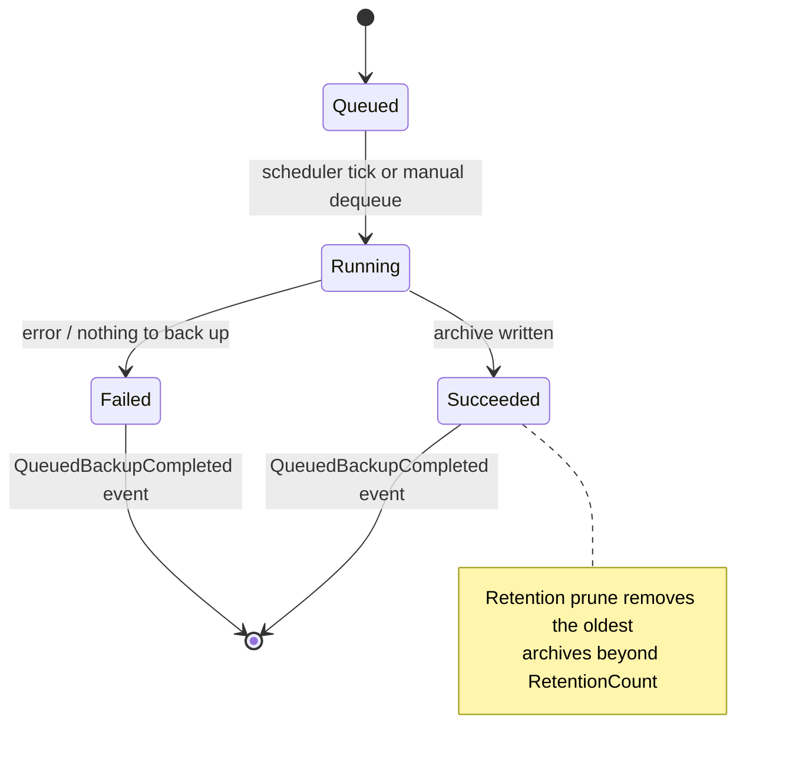
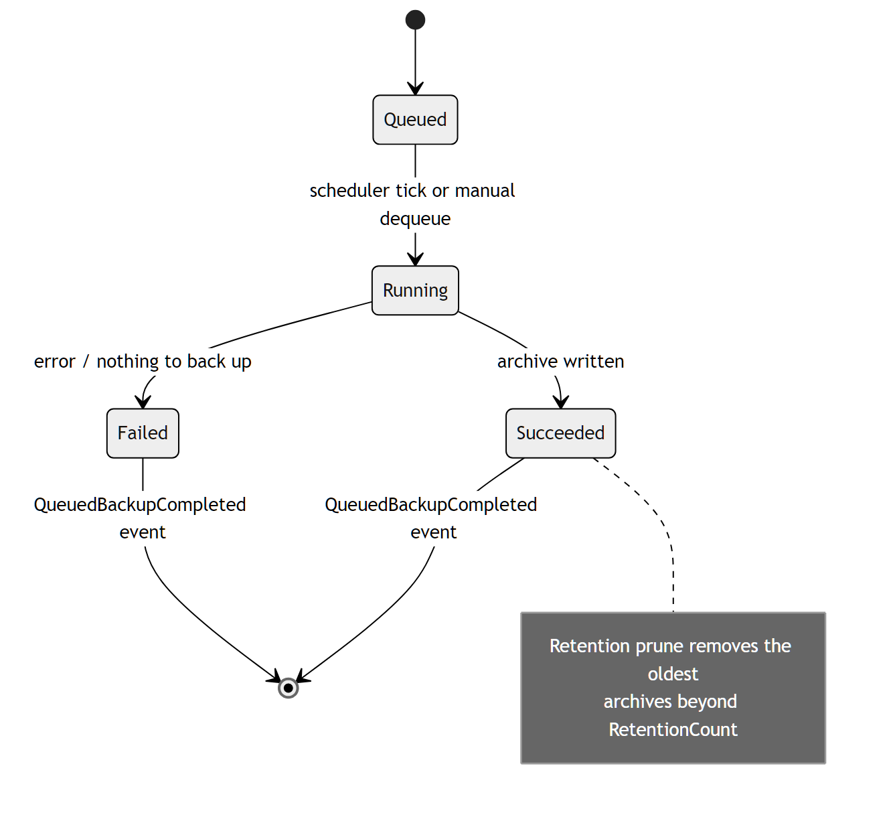

# Backup Jobs

Quasar takes versioned ZIP backups of configuration, per-server runtime state,
and world-only data. Automatic backups are queued by a scheduler (or manually)
and run one at a time, emitting a completion event and pruning old archives by
retention policy.

Relevant source:
[`AutomaticBackupService.cs`](../../Quasar/Services/Backup/AutomaticBackupService.cs),
[`QuasarBackupManifest.cs`](../../Quasar/Models/QuasarBackupManifest.cs),
[`BackupCompatibility.cs`](../../Quasar/Services/Backup/BackupCompatibility.cs),
[`BackupFormatMigrations.cs`](../../Quasar/Services/Backup/BackupFormatMigrations.cs).

There are three [`QuasarBackupKind`](../../Quasar/Models/QuasarBackupManifest.cs)
values — `Configuration`, `Server`, `World` — corresponding to the queued job
kinds `EnabledRules`, `Server`, and `World`.

---

## Queued job lifecycle

| State | Meaning |
| --- | --- |
| `Queued` | A `QueuedBackupJob` (unique id + kind) is on the unbounded channel — enqueued by the per-minute scheduler tick for due rules, or by a manual request. |
| `Running` | `RunQueuedBackupAsync` dequeues and runs the kind-specific backup. |
| `Succeeded` / `Failed` | Result carries `Success`, `CreatedCount`, `Message`, and an optional exception; raised as `QueuedBackupCompleted`. |

After a successful backup, `PruneAutomaticBackups` removes the oldest archives
beyond the rule's `RetentionCount`. Each automatic backup kind (config / server /
world) has its own schedule and retention.

---

## Restore compatibility

Restore is gated by a semantic-version check
([`BackupCompatibility.Evaluate`](../../Quasar/Services/Backup/BackupCompatibility.cs)):

- same `Major.Minor` → allowed;
- older backup → allowed only if [`BackupFormatMigrations.CanMigrate`](../../Quasar/Services/Backup/BackupFormatMigrations.cs)
  finds a contiguous upgrade path through the registered migration steps;
- newer backup than the running build → rejected (no downgrade).

The archive's `quasar-backup.json` manifest records `FormatVersion` (archive
layout) and `QuasarVersion` (the build it was taken from) to drive these rules.

---

## Related

- [Architecture › Configuration Management](../QuasarArchitecture.md#configuration-management)
- Back to the [State Machine Index](Index.md).
