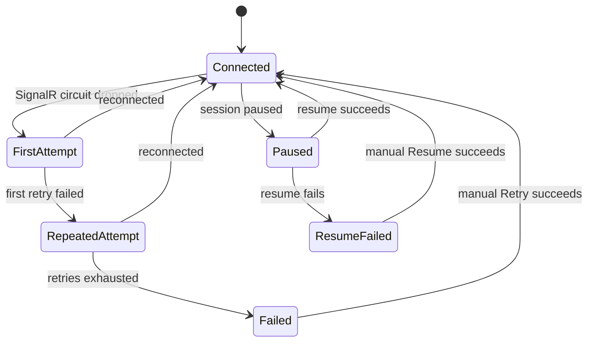
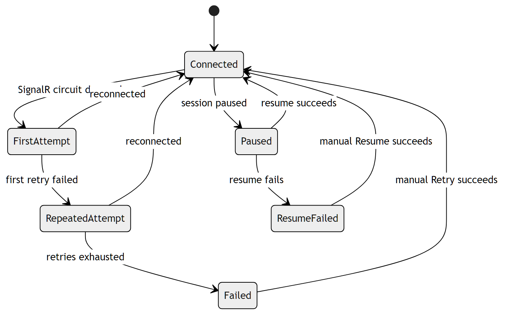

# Blazor Circuit Reconnection

The Quasar UI is a Blazor Server app, so the browser holds a SignalR circuit to
the worker. When that circuit drops — including during the brief worker cutover
of a [self-update](SelfUpdateAndRelease.md) — the framework's reconnection UI
takes over. Quasar styles this through
[`ReconnectModal.razor`](../../Quasar/Components/Layout/ReconnectModal.razor)
and its CSS/JS, but the states themselves are managed by the ASP.NET Core Blazor
circuit handler.

> This is an informational diagram of framework behavior; there is no Quasar
> enum behind it. The CSS classes that gate each visible state are
> `components-reconnect-first-attempt-visible`,
> `components-reconnect-repeated-attempt-visible`,
> `components-reconnect-failed-visible`, `components-pause-visible`, and
> `components-resume-failed-visible`.

| State | Meaning |
| --- | --- |
| `Connected` | Circuit healthy; the modal is hidden. |
| `FirstAttempt` | Circuit dropped; reconnecting silently. |
| `RepeatedAttempt` | First retry failed; a countdown is shown. |
| `Failed` | Retries exhausted; a **Retry** button is shown. |
| `Paused` | Server session paused; awaiting resume. |
| `ResumeFailed` | Resume failed; a **Resume** button is shown. |

Because a worker cutover replaces the circuit, browsers briefly reconnect after
an update — see the [practical guarantees](../QuasarArchitecture.md#self-update-and-version-rollover)
for self-update.

---

## Related

- [Self-Update and Release Cutover](SelfUpdateAndRelease.md)
- Back to the [State Machine Index](Index.md).
