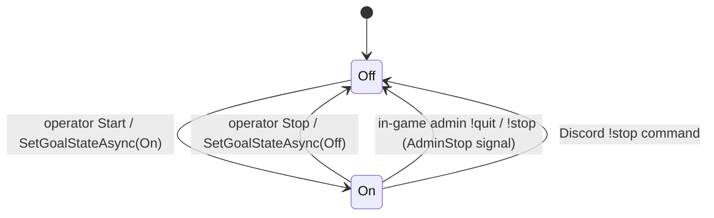
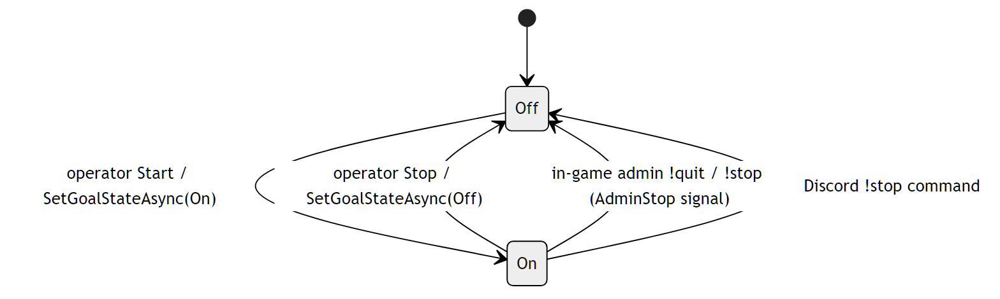
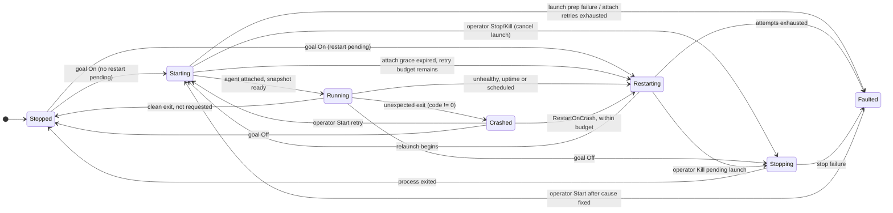
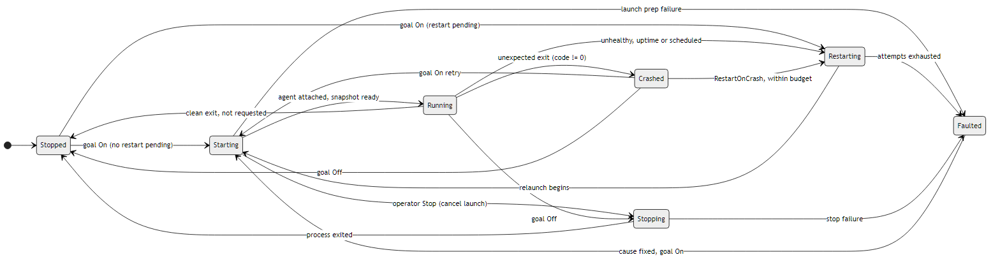
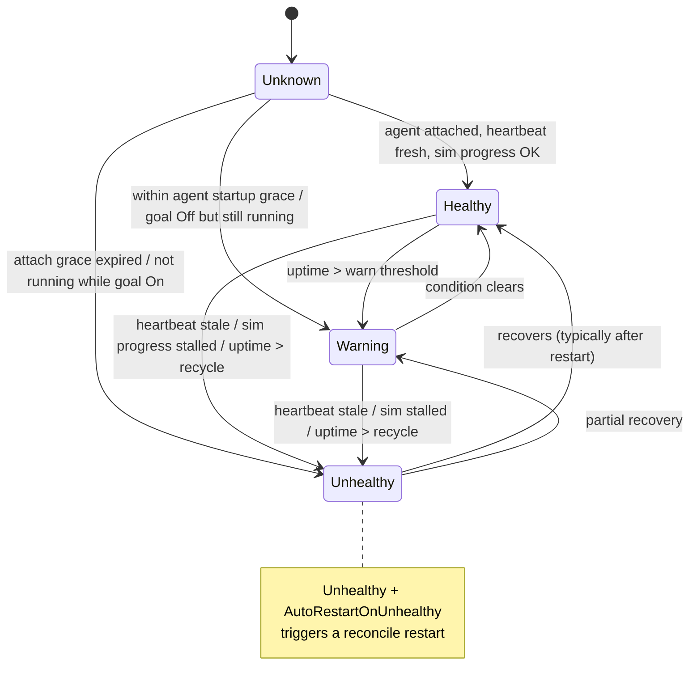
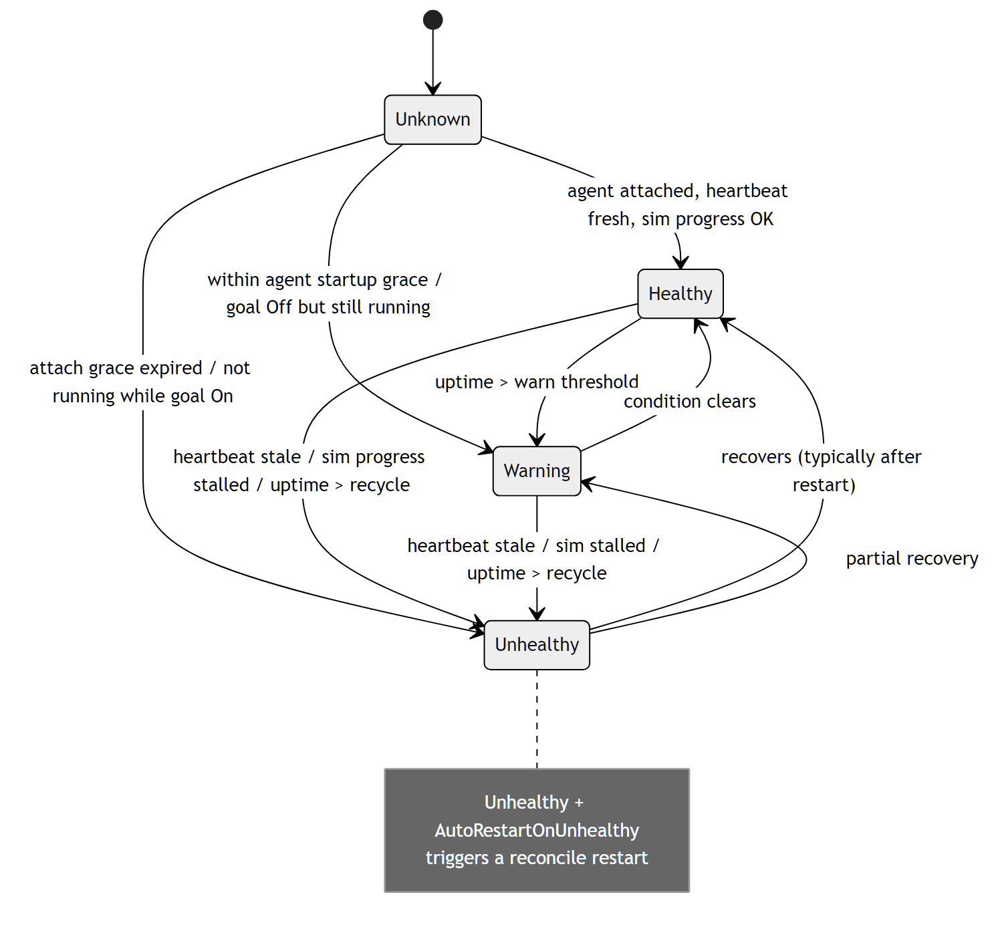

# Dedicated Server Lifecycle

Quasar supervises each managed Dedicated Server (DS) like an infrastructure
reconciler: an operator sets the **desired goal**, and the supervisor drives the
**observed process** toward it while a **health** assessment feeds automated
recovery. Three separate-but-related state values describe one server:

| State value | Enum | Meaning |
| --- | --- | --- |
| Goal state | [`DedicatedServerGoalState`](../../Quasar/Models/DedicatedServerGoalState.cs) | Desired reconciled outcome (`Off` / `On`). |
| Process state | [`DedicatedServerProcessState`](../../Quasar/Models/DedicatedServerProcessState.cs) | Observed supervisor lifecycle stage. |
| Health state | [`DedicatedServerHealthState`](../../Quasar/Models/DedicatedServerHealthState.cs) | Liveness/quality assessment of a running server. |

The reconciliation loop ([`DedicatedServerSupervisor.ReconcileAsync`](../../Quasar/Services/DedicatedServerSupervisor.cs))
runs every ~2 seconds: it evaluates health, detects process transitions, and
queues `Start` / `Stop` / `Restart` actions to close the gap between goal and
observed state.

---

## Goal state

The desired state. Operator actions usually mutate goal state first, then let
reconciliation perform the transition. An in-game admin `!quit`/`!stop` is
reported by the agent as an `AdminStop` signal so Quasar flips the goal to `Off`
(and therefore does **not** treat the shutdown as a crash to restart).

| Transition | Trigger | Source |
| --- | --- | --- |
| `Off → On` | Operator/API `SetGoalStateAsync(On)` | `DedicatedServerSupervisor.SetGoalStateAsync` |
| `On → Off` | Operator/API `SetGoalStateAsync(Off)` | `DedicatedServerSupervisor.SetGoalStateAsync` |
| `On → Off` | In-game admin `!quit`/`!stop` → agent `AdminStop` | `AgentSocketHandler.ProcessMessageAsync` (`AdminStop` case) |
| `On → Off` | Discord `!stop` command | `DiscordCommandDispatcher.DispatchAsync` |

---

## Process state

The observed supervisor lifecycle. The UI treats `Starting`, `Stopping`, and
`Restarting` as transitionary states. `Starting` shows `Stop` and an immediate
`Kill` action so an accidental or wedged launch can be cancelled before the
agent attaches; `Restarting` shows `Kill` to cancel the pending relaunch.
`Running` shows `Stop`/`Restart`; `Stopped`, `Crashed`, and `Faulted` show
`Start`.

| State | Meaning | Normal next states |
| --- | --- | --- |
| `Stopped` | No managed process is running. | `Starting`, `Restarting` |
| `Starting` | Launch in progress; agent/game snapshot not ready yet. | `Running`, `Stopping`, `Faulted` |
| `Running` | Process is alive; agent attached or reconnecting. | `Stopping`, `Restarting`, `Crashed` |
| `Stopping` | Graceful stop in progress; waiting for exit. | `Stopped`, `Faulted` |
| `Restarting` | Intentional restart sequence in progress. | `Starting`, `Running`, `Faulted` |
| `Crashed` | Process exited unexpectedly. | `Starting`, `Restarting`, `Stopped` |
| `Faulted` | Launch/restart failed or attempts exhausted. | `Starting` after the cause is fixed |

**Restart policy & faults** (all in [`DedicatedServerSupervisor`](../../Quasar/Services/DedicatedServerSupervisor.cs)):

- Crash detection: a non-zero exit with no stop requested becomes `Crashed`;
  `HandleProcessExitedAsync` re-launches via `Restarting` when `RestartOnCrash`
  is set and the consecutive attempt budget (`RestartAttempts` vs
  `MaxRestartAttempts`, default 3) is not exhausted, after
  `RestartDelaySeconds`. When the budget is exhausted the server becomes
  `Faulted` and reconciliation does not keep trying. The attempt counter resets
  after a server runs past the reset window.
- `Faulted` is reached from `SetFaulted` on launch-prep failures (missing world
  template, runtime not ready, executable/working-dir missing, runtime prep
  failure, process start failure) or from crash-restart budget exhaustion. An
  explicit operator `Start` resets the streak and retries after the cause is
  fixed; the reconcile loop does not auto-retry `Crashed`/`Faulted` states.
- Agent attach retries: while a process is still `Starting`, health monitoring
  waits `AgentStartupGraceSeconds` for Quasar.Agent. If it does not attach and
  `AutoRestartOnUnhealthy` is enabled, the supervisor kills the starting process,
  waits `AgentAttachRetryDelaySeconds`, and relaunches. After
  `AgentAttachRetryAttempts` consecutive attach retries, the server becomes
  `Faulted`.
- Planned restarts come from the health policy (`Unhealthy` +
  `AutoRestartOnUnhealthy`), `MaximumUptime`, and `DailyRestartTimeLocal`
  (optionally staggered by `AvoidSimultaneousScheduledRestarts`).

---

## Health state

Computed every reconcile pass by `EvaluateHealth`. Health drives automated
recovery: an `Unhealthy` server with `AutoRestartOnUnhealthy` is restarted;
`Warning` only surfaces in the UI / Discord presence.

| State | When | Effect |
| --- | --- | --- |
| `Unknown` | Monitoring disabled, or transitional (starting/restarting), or `goal Off` and stopped. | None. |
| `Healthy` | Agent attached, heartbeat fresh, simulation progress above threshold, uptime under warn threshold. | None. |
| `Warning` | Within agent startup grace, uptime past the warn threshold, or `goal Off` but process still running. | Surfaced in UI/Discord only. |
| `Unhealthy` | Agent attach grace expired, heartbeat stale beyond `AgentHeartbeatTimeoutSeconds`, simulation-frame progress stalled, uptime past recycle threshold, or process not running while `goal On`. | Auto-restart if `AutoRestartOnUnhealthy`. |

The simulation-frame check mirrors the dedicated server's own watcher:
`frameProgressScore = deltaFrames / (elapsedSeconds * 60)` is compared against a
configurable minimum, with save-in-progress windows resetting the baseline
instead of counting as a stall (`EvaluateSimulationProgress`).

---

## Related

- [Agent Connection](AgentConnection.md) — the agent attach/heartbeat that feeds health.
- [Architecture › Process Supervision](../QuasarArchitecture.md#process-supervision)
- Back to the [State Machine Index](Index.md).
