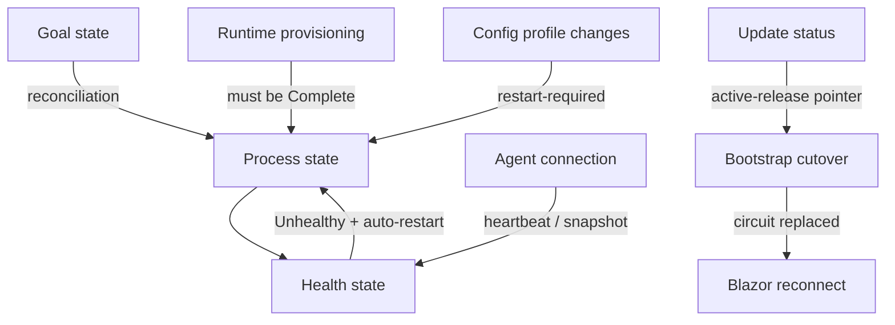

# State Machine & Object-State Diagrams

This section documents the object states and state machines across the Quasar
stack. Each page contains a Mermaid `stateDiagram-v2` (rendered inline on GitHub)
**and** a pre-rendered PNG, plus a transition table and source references.

Diagram sources live in [`diagrams/`](diagrams) as `.mmd` files alongside their
rendered `.png` (regenerate with the [command below](#regenerating-the-pngs)).

## Diagrams

| Page | State machines | Backing type(s) |
| --- | --- | --- |
| [Dedicated Server Lifecycle](DedicatedServerLifecycle.md) | Goal state · Process state · Health state | `DedicatedServerGoalState`, `DedicatedServerProcessState`, `DedicatedServerHealthState` |
| [Agent Connection Lifecycle](AgentConnection.md) | Agent-side connection · Supervisor-side registry view | `AgentConnection`, `AgentRegistry` |
| [Self-Update and Release Cutover](SelfUpdateAndRelease.md) | Update status · Bootstrap worker cutover | `QuasarUpdateStatus`, `LauncherCoordinator` |
| [Managed Runtime Provisioning](ManagedRuntimeProvisioning.md) | Warmup state · Component install phase | `ManagedRuntimeWarmupState`, `ManagedRuntimeInstallPhase` |
| [Backup Jobs](BackupJobs.md) | Queued backup-job lifecycle | `QueuedBackupJobKind`, `QuasarBackupKind` |
| [Agent Profiler Mode](ProfilerMode.md) | Live profiler patch-depth switching | `AgentProfilerMode` |
| [Config Profile Changes](ConfigProfileChanges.md) | Edit / pending-decision / save lifecycle | `QuasarConfigProfileCatalog` |
| [Theme Mode](ThemeMode.md) | System / Light / Dark preference | `ThemeMode` |
| [Blazor Circuit Reconnection](BlazorReconnect.md) | SignalR reconnect UI (framework) | `ReconnectModal` |

## How these relate



## Regenerating the PNGs

The PNGs are rendered from the `.mmd` sources with
[`@mermaid-js/mermaid-cli`](https://github.com/mermaid-js/mermaid-cli):

```bash
cd Docs/StateMachines/diagrams
for f in *.mmd; do
  npx -y @mermaid-js/mermaid-cli -i "$f" -o "${f%.mmd}.png" \
    -c mermaid-config.json -b white -s 2
done
```

---

Back to the [Architecture overview](../QuasarArchitecture.md) ·
[code handbook TOC](../Reference/TOC.md).
