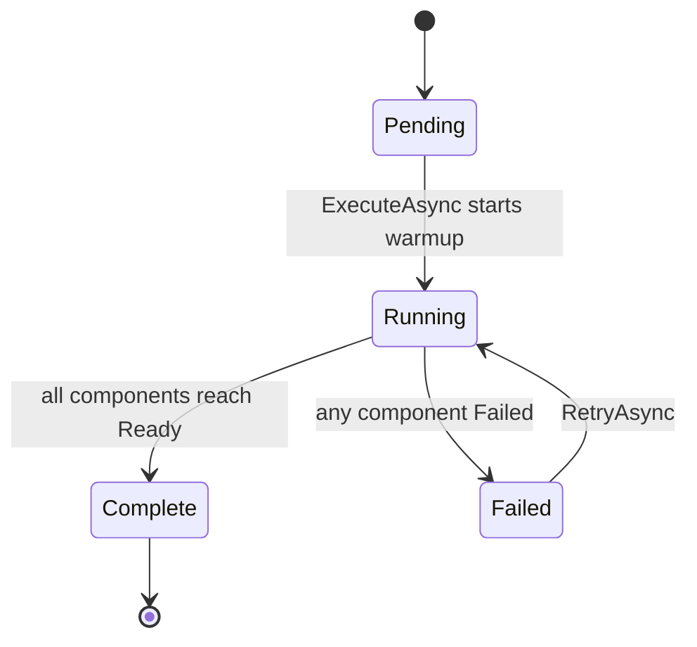
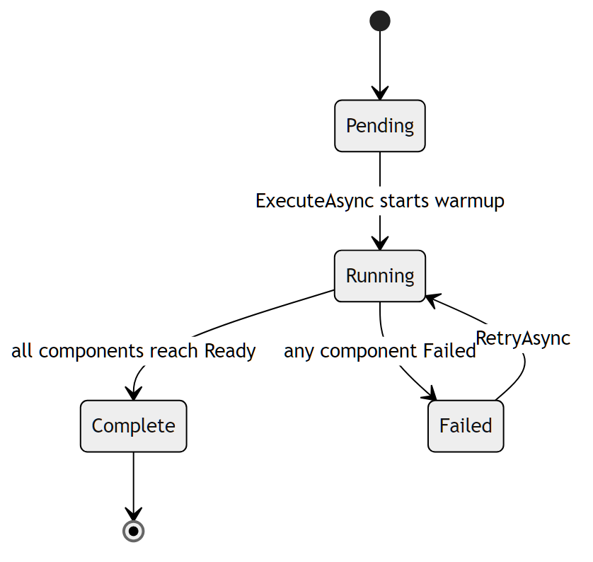
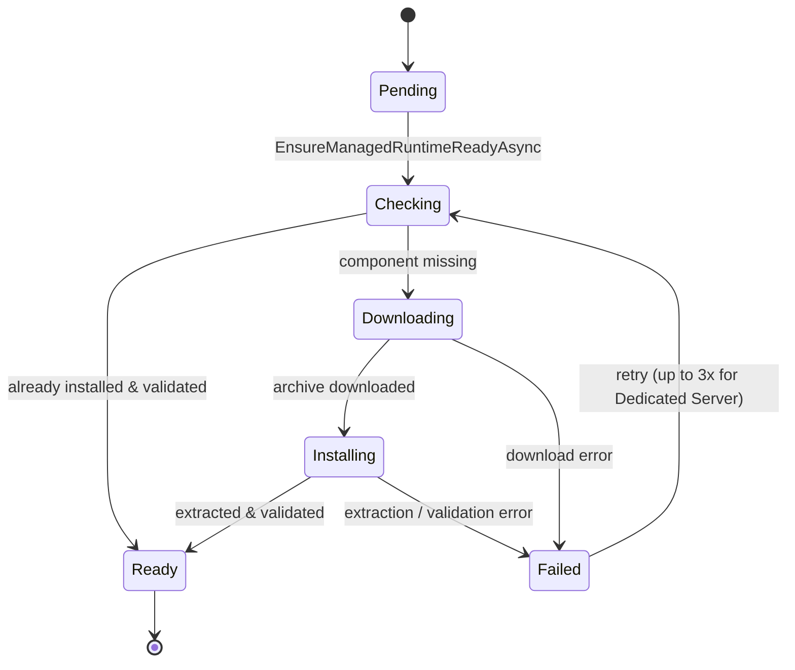
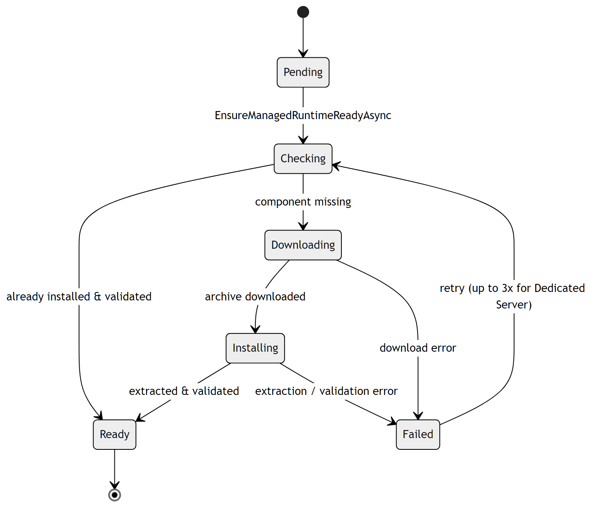

# Managed Runtime Provisioning

Before any managed server can launch, Quasar must have the Space Engineers
Dedicated Server build (and SteamCMD to fetch it) installed under its managed
runtime tree. A background **warmup** service orchestrates this, and each
**component** moves through its own download/install phases. While warmup is not
`Complete`, server launches are blocked.

Relevant source:
[`ManagedRuntimeWarmupService.cs`](../../Quasar/Services/ManagedRuntimeWarmupService.cs),
[`ManagedDedicatedServerRuntimeResolver.cs`](../../Quasar/Services/ManagedDedicatedServerRuntimeResolver.cs).

---

## Warmup state (overall)

[`ManagedRuntimeWarmupState`](../../Quasar/Services/ManagedRuntimeWarmupService.cs)
is the aggregate state of the whole runtime.

| State | Meaning |
| --- | --- |
| `Pending` | Initial; components listed as waiting to be checked. |
| `Running` | `EnsureManagedRuntimeReadyAsync` is checking/downloading/installing components. |
| `Complete` | All components `Ready`; `IsReady` is true and server launches are unblocked. |
| `Failed` | A component failed; all incomplete components are marked `Failed` with the error. `RetryAsync` re-runs warmup. |

---

## Component install phase

Each component (`SteamCmd`, `DedicatedServer`) advances through
[`ManagedRuntimeInstallPhase`](../../Quasar/Services/ManagedDedicatedServerRuntimeResolver.cs),
mapped onto `ManagedRuntimeComponentState` for UI progress.

| Phase | Meaning |
| --- | --- |
| `Pending` | Queued, not yet inspected. |
| `Checking` | Verifying whether the component is already installed and valid. |
| `Downloading` | Streaming the asset to disk (SteamCMD package, or the DS build via SteamCMD app `298740`). |
| `Installing` | Extracting the archive (ZIP / tar.gz / 7z auto-detected), validating required files, setting the executable bit on Linux. |
| `Ready` | Installed and validated (terminal). |
| `Failed` | Any phase errored or validation failed; the DS component retries up to 3 times. |

DS validation requires `DedicatedServer64` to contain the SpaceEngineers
dedicated executable plus `VRage.dll`, `Sandbox.Game.dll`, and
`SpaceEngineers.Game.dll`; Linux additionally prepares the native steam runtime.

---

## Related

- [Self-Update and Release Cutover](SelfUpdateAndRelease.md) — updating the Quasar worker itself.
- [Dedicated Server Lifecycle](DedicatedServerLifecycle.md) — a `Faulted` server can be caused by runtime-not-ready.
- Back to the [State Machine Index](Index.md).
