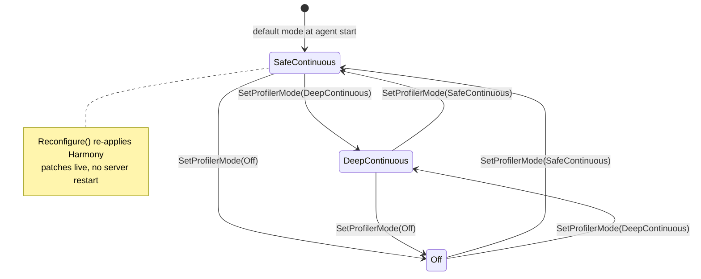
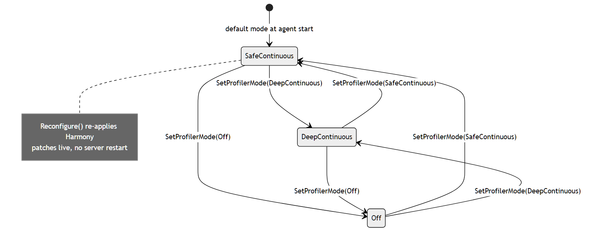

# Agent Profiler Mode

`Quasar.Agent` runs a continuous in-process profiler whose patch depth is
selected by [`AgentProfilerMode`](../../Quasar.Agent/AgentProfilerMode.cs).
Mode changes are applied **live** — the agent re-applies its Harmony patches
without restarting the server.

Relevant source:
[`AgentProfilerMode.cs`](../../Quasar.Agent/AgentProfilerMode.cs),
[`AgentProfilerPatches.cs`](../../Quasar.Agent/AgentProfilerPatches.cs),
[`ServerCommandType.cs`](../../Magnetar.Protocol/Transport/ServerCommandType.cs).

| Mode | UI label | Patch depth |
| --- | --- | --- |
| `Off` | (disabled) | No profiler patches. |
| `SafeContinuous` | "Simple, low overhead" | Named high-level paths only (frame/update, programmable-block scripts, physics, replication/network/session, GPS, block-limit work). Always-on default. |
| `DeepContinuous` | "Extensive, deep detail" | Adds detailed network-event hooks and IL call-site transpilers for session components, replication simulation, entity update dispatch, parallel waits/callbacks, and Havok physics stepping. |

**Transitions.** Quasar sends `ServerCommandType.SetProfilerMode`; the agent's
`AgentProfilerPatches.Reconfigure(mode)` calls `AgentProfiler.SetMode`, then (if
the mode actually changed) `Dispose()` unpatches and `Apply()` re-patches at the
new depth. Per-server `AgentProfilerMode` values persist, with a global
`Quasar:AgentProfilerMode` / `QUASAR_AGENT_PROFILER_MODE` fallback for older
definitions. Patch failures are logged and the agent keeps the rest of the
profiler surface.

---

## Related

- [Architecture › Current Repository Status](../QuasarArchitecture.md#current-repository-status) — profiler telemetry overview.
- Back to the [State Machine Index](Index.md).
