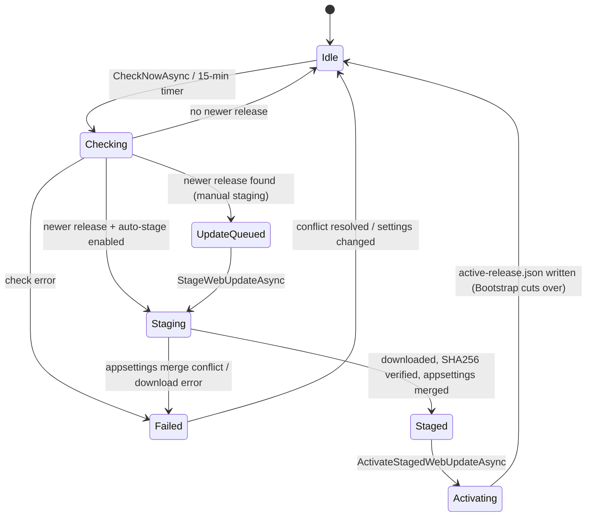
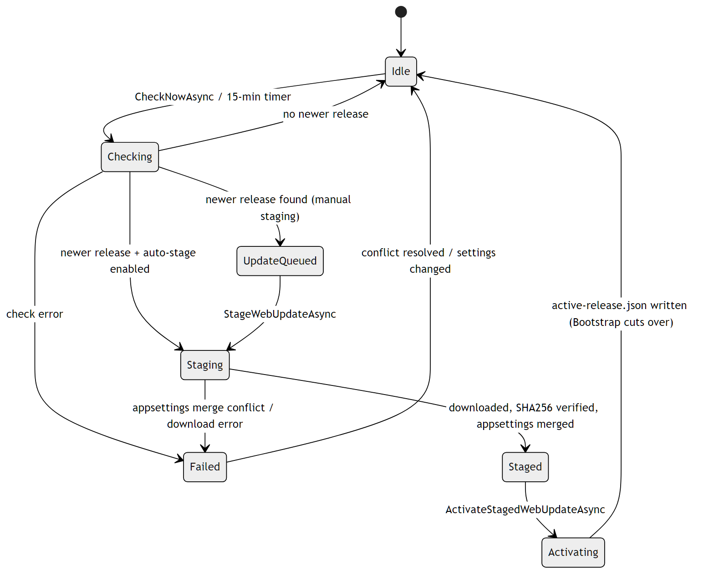
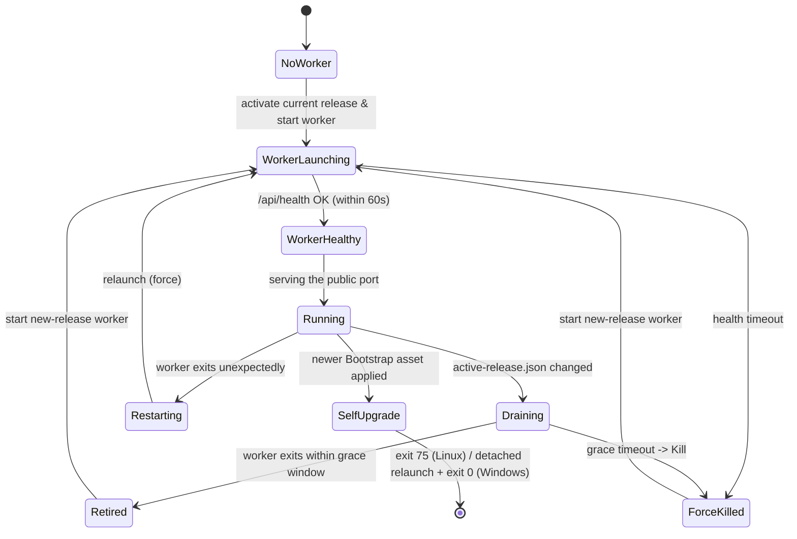
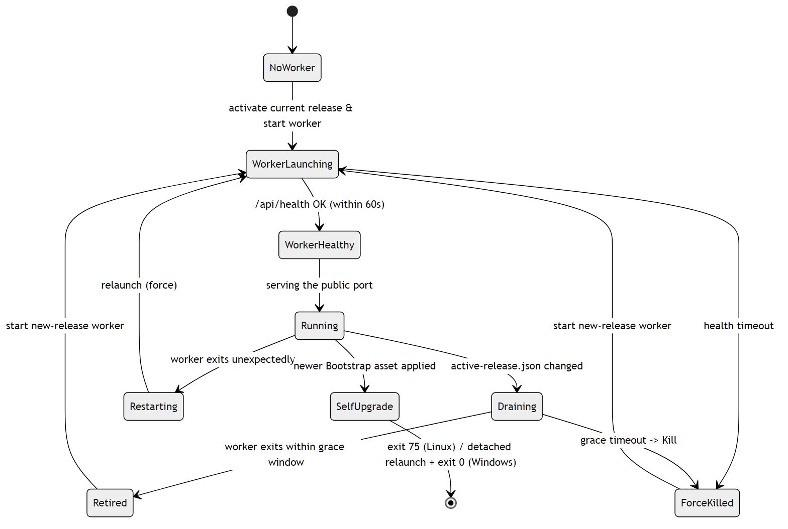

# Self-Update and Release Cutover

Quasar updates itself in two coordinated state machines: the **worker** (the
Blazor supervisor) checks GitHub, stages, and activates a new web release; and
the stable **Bootstrap launcher** observes the activated release pointer and
performs the worker cutover while keeping managed DS processes running.

Relevant source:
[`QuasarUpdateSnapshot.cs`](../../Quasar/Services/Updates/QuasarUpdateSnapshot.cs),
`QuasarUpdateService`,
[`Quasar.Bootstrap/Program.cs`](../../Quasar.Bootstrap/Program.cs) (`LauncherCoordinator`).

See also the deployment guides:
[Linux](../LinuxDeploymentAndUpdates.md) · [Windows](../WindowsDeploymentAndUpdates.md).

---

## Update status (worker side)

[`QuasarUpdateStatus`](../../Quasar/Services/Updates/QuasarUpdateSnapshot.cs)
tracks the staged-update workflow shown on `/settings/updates`.

| State | Meaning |
| --- | --- |
| `Idle` | No update activity. |
| `Checking` | Querying GitHub releases (every 15 min, or on demand). |
| `UpdateQueued` | A newer release exists and awaits an explicit stage (auto-stage off). |
| `Staging` | Downloading the asset, verifying it against `SHA256SUMS`, and performing the three-way `appsettings.json` merge (data-dir base + install values + new defaults). |
| `Staged` | Payload validated and ready to activate. |
| `Activating` | Promoting the staged payload into `ManagedRuntime/WebService/<version>/` and writing `Updates/active-release.json`. |
| `Failed` | A check/download error or an unresolved `appsettings.json` merge conflict; cleared when the conflict is resolved or settings change. |

---

## Bootstrap launcher / worker cutover

The launcher owns the public port (systemd service on Linux, Scheduled Task on
Windows). It watches the active-release pointer and drains/replaces the worker —
a launcher, **not** a reverse proxy — so the public endpoint has only a short
listener gap while managed Magnetar servers keep running detached.

| State | Meaning |
| --- | --- |
| `NoWorker` | Startup before a worker exists; may download an initial UI worker. |
| `WorkerLaunching` | Worker process started; polling `/api/health` (up to 60s). |
| `WorkerHealthy` / `Running` | Worker serving the public port. |
| `Draining` | Pointer change detected; the launcher posts `/api/internal/drain` (authenticated with the per-session launcher token) and waits for graceful exit. |
| `Retired` / `ForceKilled` | Old worker exited within the grace window, or was killed after timeout. |
| `Restarting` | Worker exited unexpectedly (not a launcher request); relaunched with `force`. |
| `SelfUpgrade` | A newer Bootstrap asset was applied by the periodic monitor or by a consumed `Updates/bootstrap-update-request.json` request from the Updates page; forced requests target the detected version and platform asset. Linux exits **75** so systemd restarts it; Windows spawns a detached `Quasar.exe serve --quiet` replacement and exits **0**. |

The pointer is `Updates/active-release.json`
([`QuasarActiveReleasePointer`](../../Magnetar.Protocol/Runtime/QuasarActiveReleasePointer.cs)),
written by the worker's `Activating` step and observed via a `FileSystemWatcher`
(debounced ~250ms).

Managed DS processes are not stopped during worker cutover, so their loaded
`Quasar.Agent` assembly can remain older than the newly active web release. On a
later server Restart action, `DedicatedServerSupervisor.RestartServerAsync`
compares the attached agent's hello version with the bundled
`Agent/Quasar.Agent.dll`; a mismatch is handled by the normal full stop/start
path, which runs launch preparation and injects the current agent before the
process starts again.

---

## Related

- [Managed Runtime Provisioning](ManagedRuntimeProvisioning.md) — DS/SteamCMD install before a server can start.
- [Architecture › Self-Update and Version Rollover](../QuasarArchitecture.md#self-update-and-version-rollover)
- Back to the [State Machine Index](Index.md).
