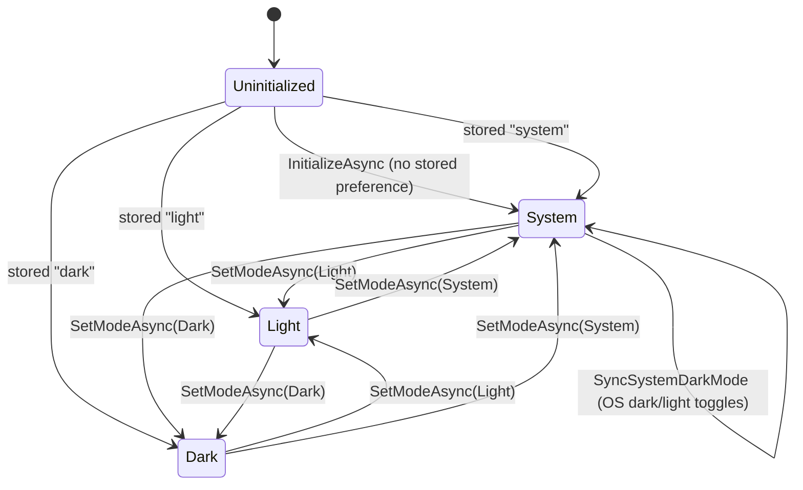
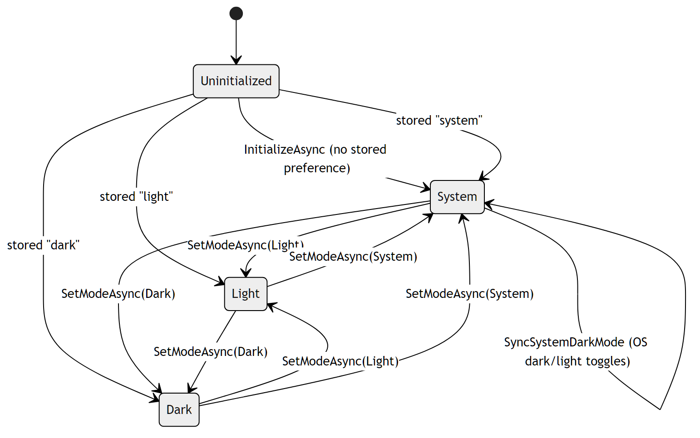

# Theme Mode

The Blazor UI supports light/dark/system theming, persisted to browser local
storage so the operator returns to the same mode. State is held by
[`ThemePreferenceService`](../../Quasar/Services/ThemePreferenceService.cs) with
the [`ThemeMode`](../../Quasar/Services/ThemePreferenceService.cs) enum
(`System`, `Light`, `Dark`).

| State | Meaning |
| --- | --- |
| `Uninitialized` | Before `InitializeAsync` reads local storage (`quasar.theme.mode`). |
| `System` | Follows the OS preference; `SyncSystemDarkMode` recomputes `IsDarkMode` when the OS toggles. |
| `Light` / `Dark` | Explicit mode; `IsDarkMode` fixed to false/true. |

`SetModeAsync` updates the mode, recomputes `IsDarkMode`, raises
`ThemeModeChanged` when the effective dark/light value changes, and persists the
string (`"light"` / `"dark"` / `"system"`). In `System` mode the effective
dark/light value is queried from JS (`quasarConfigs.getSystemDarkMode`).

---

## Related

- [Architecture › UI Theme](../QuasarArchitecture.md#ui-theme)
- Back to the [State Machine Index](Index.md).
